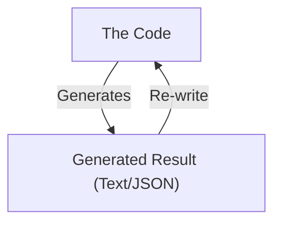
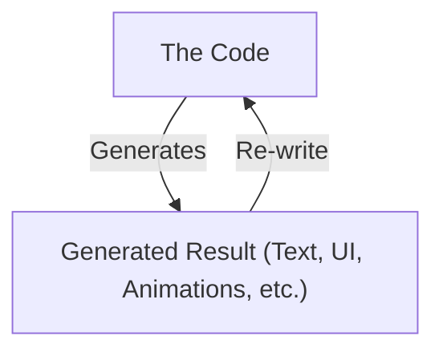

## LLM: The most efficient lossy compression

Whether we are happy about it or not, LLMs have become an integral part of our software development workflow. As someone with zero experience in machine learning, my understanding of the inner workings of an LLM is fairly primitive: to me, an LLM is the most efficient lossy compression algorithm humans have ever written.

It is fascinating to think that with an 8B parameter Llama model, we've compressed a vast swath of human knowledge into a 4GB file.

Obviously, a lot of information is neglected or simplified during this process. What the model does with this missing information is exactly what causes "hallucinations."

When a model is being trained, it is primarily evaluated for accuracy. Consider a question like:

> "On what date did [an event] happen?"

If that specific information isn't present in the model's "compressed" knowledge, it has two choices:
1. It can abstain from answering, saying "I don't know."
2. It can guess.

If it randomly selects a date, there is a 1/365 chance of being right. In many multiple-choice evaluations, the model might have a 1 in 3 or 1 in 4 chance of getting the right answer just by guessing. Because evaluations often reward correct answers without heavily penalizing confident incorrect ones, the process essentially encourages guessing.

It is always a balance: you can have an honest but "dumb" model that admits it knows nothing, or a smart-seeming model that occasionally hallucinations. Most LLM providers are trying to find the perfect equilibrium in between.

## Intrinsic and Extrinsic Hallucinations

To better understand these "guesses," we can divide hallucinations into two primary categories:

- **Intrinsic Hallucinations**: These occur when the model contradicts the provided input or context. It’s an internal inconsistency where the model "knows" the context but fails to follow it.
- **Extrinsic Hallucinations**: these occur when the model introduces non-existent information that isn't consistent with its training data or the provided context.

The probability of an extrinsic hallucination is generally much higher than that of an intrinsic one.

For instance, most models will struggle significantly if you ask a very niche or specific question about a less popular framework (let's say, Svelte). Without specific context, you will see a high volume of extrinsic hallucinations as the model tries to fill in the gaps with patterns from more popular frameworks like React.

However, if you provide the model with an `llm.txt`, a "skills" file, or specific documentation for Svelte, the chances of hallucination drop dramatically. This is why, if you want your AI tools to hallucinate less, it is crucial to add all relevant `skills.md` and `agents.md` files to your project. By providing the "missing" information explicitly, you remove the incentive for the model to guess.

## The Feedback Loops

Another critical factor in LLM hallucinations, especially in agentic coding, is the **Feedback Loop**. 

As a frontend developer, I've noticed a weird problem with AI coding agents: they are significantly better at writing backend code than frontend code. I’m not talking about basic marketing pages or simple demos, but complicated user interactions, multi-step forms, and complex animations.

The reason for this discrepancy lies in how the feedback loops differ between the two domains:

### The Feedback Loop in Backend

### The Feedback Loop in Frontend

LLMs are fundamentally built to process and generate **text**. In the backend, the feedback loop is almost entirely text-based (logs, JSON outputs, error messages). The model can easily "understand" its own output and correct it.

In the frontend, however, the "result" is often visual or behavioral. When a feedback loop includes things that are not text, like the subtle timing of an animation or the layout of a complex grid, the model's performance starts to degrade. The more complicated and "non-textual" the feedback becomes, the more likely the LLM is to hallucinate a solution that doesn't actually work in the browser.

### Bridging the Gap

To make software more resistant to hallucinations, we need to ensure the feedback loop is as "text-friendly" as possible. This can be achieved through:

1.  **Proper MCP Support**: Providing the LLM with specialized tools to "see" non-textual data. For example, using a **Figma MCP** to give the model design context, or a **Chrome DevTools MCP** to allow the model to inspect the browser state directly.
2.  **State Machines**: Using techniques like [State Machines](/blog/the-last-state-solution) allows you to define your application's logic in a structured, predictable way. By making the "states" of your UI explicit and textual, you allow the LLM to build and reason about the application without needing constant visual inspection.

By optimizing these loops, we move the LLM away from guessing and towards engineering.

## GitHub Copilot Dev Days 2026

This article is a text version of a talk I gave at **GitHub Copilot Dev Days** in Trivandrum, Kerala, in April 2026. 

You can find the full presentation slides here: [Confidently Wrong: PPT](https://docs.google.com/presentation/d/1peIgH46bVfP75sj9zLiuhxAoGmp1gzfc43n9ByQlcIU/edit?usp=sharing)

### Event Gallery

