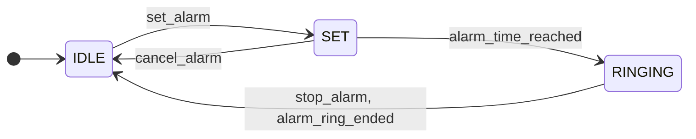
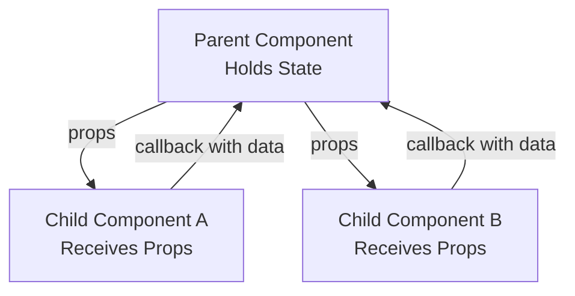
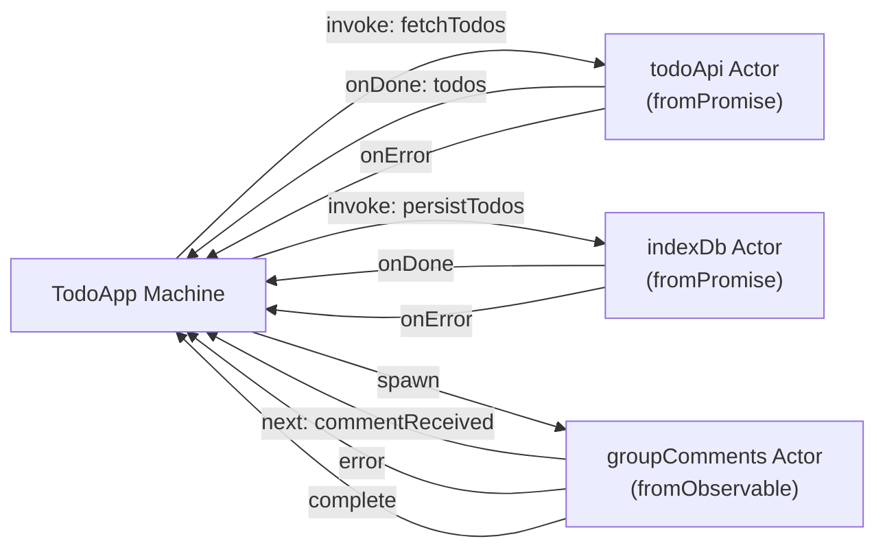

As a front-end developer, a large portion of my work revolves around state. Where state should live, how it should be structured, how it changes over time, and how those changes affect the UI.

Recently, I came across the concept _State Machines_, and it forced me to rethink how I approach state management. I have a lot to say about it. This article is an attempt to organize those thoughts.

## State Machines

Before going any further, we need to step back and talk briefly about **The Theory of Computation**. More specifically, we need to talk about **state machines**.

> A state machine, formally referred to as a finite state machine or finite automaton, is a mathematical model of computation used to describe systems whose behavior can be represented as transitions between a finite number of discrete states.

A **finite state machine** consists of a **start state**, an **end state**, and any number of **intermediate states**. At any point in time, the machine exists in exactly one of these states.

The machine moves from one state to another in response to **inputs**. In some cases, these transitions are further constrained by **conditions**, often called **guards**. A **transition** is the act of moving from one state to another as a result of an input.A **state**, in this context, represents the **current condition or mode of the system**, and it determines **which transitions are allowed and which are not**. A state defines the set of valid behaviors a system can exhibit at a given moment.

## A Simple State Machine

Consider a simple **alarm clock state machine**:

In this example, the alarm clock can exist in exactly one of three states: **IDLE**, **SET**, or **RINGING**.

> A finite state machine can only be in one state at any given time.

Initially, the alarm starts in the **IDLE** state. From **IDLE**, the only valid transition is to **SET**, which occurs when the user decides to set an alarm. The system cannot transition directly from **IDLE** to **RINGING**, because no such transition exists.

> If a transition is not defined, it is impossible.

When the alarm is in the **SET** state, it may transition to **RINGING** once the `alarm_time_reached` signal is received. Alternatively, the user may cancel the alarm, returning the system back to **IDLE**.

What is interesting here is that a large amount of behavior is implicitly encoded in the machine, even though it is never explicitly written as rules or conditionals.

> State machines make invalid states and transitions unrepresentable by construction.

## Redux and Zustand

Now that we understand the core idea behind **state machines**, it is time to look at how they apply to software design. While state machines are a general concept that can be used across many domains, this section focuses specifically on **front-end development**.

I have been working in front-end development for a few years now. Given the pace at which JavaScript frameworks and tooling evolve, that is a lot of time. Initially, the primary state management solution used at my workplace was **Redux**, and like many teams, we ran into its limitations.

For me, Redux often felt like overkill for many of the problems I was trying to solve. The underlying idea is straightforward: there is a defined global state, and that state changes in response to well defined actions. Conceptually, this makes sense. But it was too heavy and we need to do too much...
Zustand offered much of what Redux provided, but with a smaller footprint and far less boilerplate. It felt simpler, more direct, and easier to reason about.

I am not planning to switch away from **Zustand** anytime soon.

But there is an entirely new issue that we haven't yet discussed. This issue is not a limitation of Zustand itself. It exists regardless of which state management library you choose.

## The Sandboxing Cycle

If you have ever worked on an application without a front-end framework, using plain **Vanilla JavaScript**, you already know how difficult state management can become. Any part of the application can communicate with any other part, directly and implicitly.

Very quickly, this leads to a situation where:

> There are so many connections that they start creating bugs and security holes.

React addressed this problem by introducing **component-based isolation**. Each component owns its internal state and receives data through properties passed down from its parent. Nothing outside a component can directly read or mutate its state.
A component’s state is private and can only be influenced through explicit inputs.

If a child component needs access to its parent’s state, that state must be explicitly passed down as props. This constraint dramatically reduces accidental coupling and makes data flow easier to reason about.

However, if this model were perfect, we would never have needed external **state management libraries** in the first place.

It can quickly become unwieldy. If two distant components need access to the same piece of data, that data must be lifted up to their nearest common parent. From there, it has to be passed down through every intermediate layer as props until it finally reaches the components that need it.

A single variable may travel through many components that neither use nor care about it, simply to be accessed in two places.

At that point, a new concern emerges:

> I wish these parts of the application could communicate more easily.

To address this, libraries like **Redux** and **Zustand** introduce the idea of **global state**. Instead of threading data through component hierarchies, any part of the application can access shared state directly.

At first glance, this feels like the perfect solution.

"Finally, different parts of the application can communicate easily."

But this raises another question. If everything reads from and writes to a global store, are we actually solving the problem, or are we recreating the original one?

When every component can connect to the same global state, the system once again starts to get spagettified.

> There are so many connections that they start creating bugs and security holes.

And just like that, we find ourselves back at the beginning of the cycle.

On an honest note, in reality, most well-maintained systems never fully reach this extreme. Teams are usually disciplined enough to avoid a truly “everything is global” store.

Still, the fact that this is _possible_ is deeply uncomfortable to me.

The discomfort comes from a deeper issue. Every solution we have discussed so far focuses primarily on **where data lives** and **how it can be updated**. Redux, Zustand, all of them does not answer questions like:

> When is this action actually allowed?

That question is usually encoded indirectly through conditionals, flags, and implicit assumptions scattered across the codebase. As the system grows, these assumptions become harder to track and easier to violate.

This is where the idea of **state machines** starts to feel relevant. Not as another way to store data, but as a way to model **behavior** itself.

## The Elephants In The Room

I tend to oversell things I am passionate about, so before jumping into an implementation with XState, I want to clarify a few points first.

### It's Not All Sunshine And Rainbows

Earlier in this article, I pointed out several drawbacks of Redux. Interestingly, almost all of those criticisms also apply to XState. It is **complex**, relatively **heavy in terms of bundle size**, and has a **steep learning curve**, a lot steeper than Redux itself.

Another important point to note is that **not all problems can or should be solved with XState**. State machines(Or the Actor Model) are a powerful abstraction, but they are not a universal one.
Because of this, XState is not a direct replacement for a global state solution. It does not aim to manage arbitrary shared data in the way Redux or Zustand does, nor should it be forced into that role.

Despite all of this, I still consider XState an important tool in my arsenal.

XState works best when modeling **finite, behavior-driven systems** with well-defined states and transitions. For everything else, traditional state management tools remain not only sufficient, but often more appropriate.

I Think the earlier section should already hint at why that distinction matters.

### Xstate And The Actor Model

Up to this point, the discussion has focused primarily on **state machines**. Naturally, this can make XState appear to be just another state machine library. While that is partially true, it does not capture the full picture.

XState is more than a state machine library. At its core, it is built around a concept known as the **Actor Model**.

> The Actor Model is a mathematical model of concurrent computation in which an _actor_ is the fundamental unit of computation.

In this model, systems are composed of independent actors that communicate exclusively through **message passing**. Each actor encapsulates its own state and behavior, processes messages one at a time, and can send messages to other actors.

State machines and statecharts are used to model the internal logic of these actors. Multiple actors can exist simultaneously, each running its own machine, and they can communicate with one another in a structured and predictable way.

This is the mental model XState encourages. Not a single, monolithic state machine, but a network of communicating actors, each responsible for a well-defined piece of behavior.

